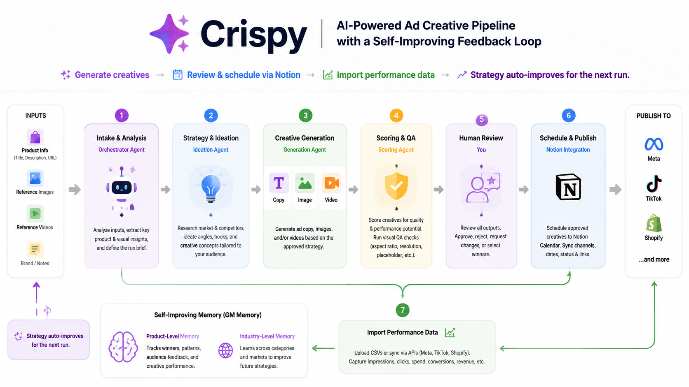
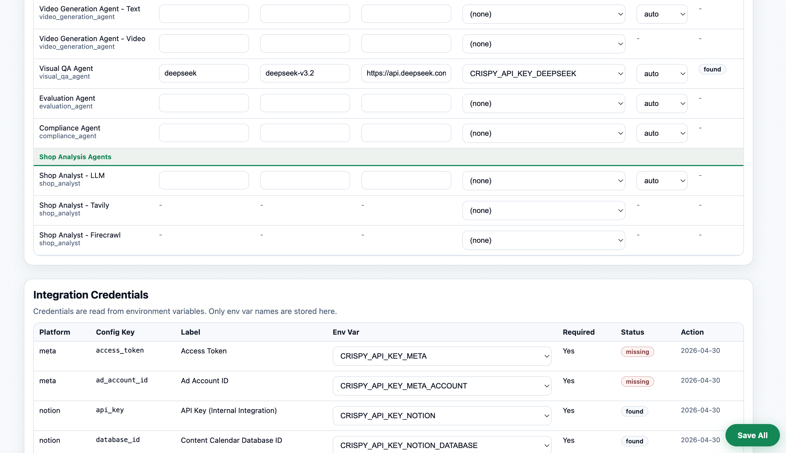
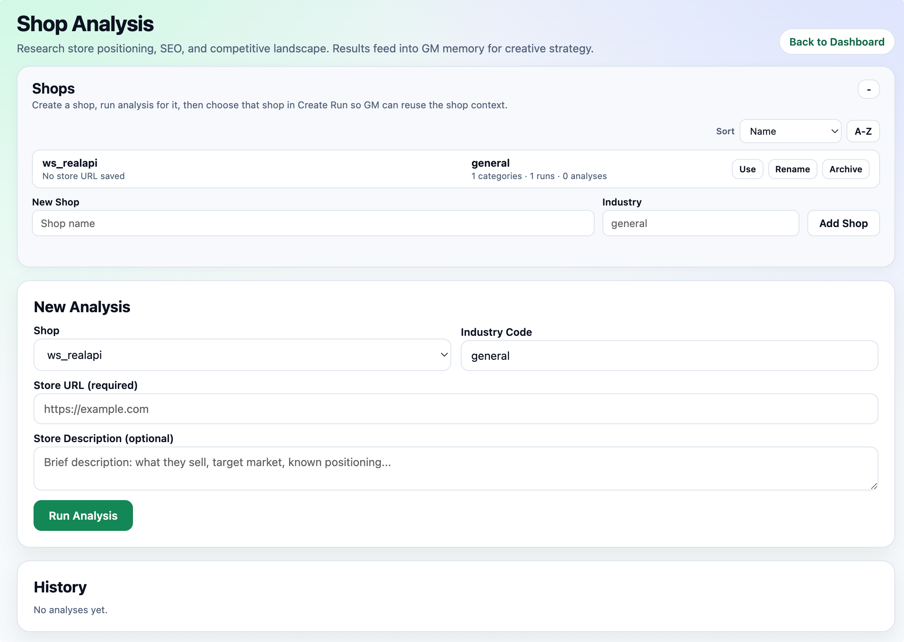
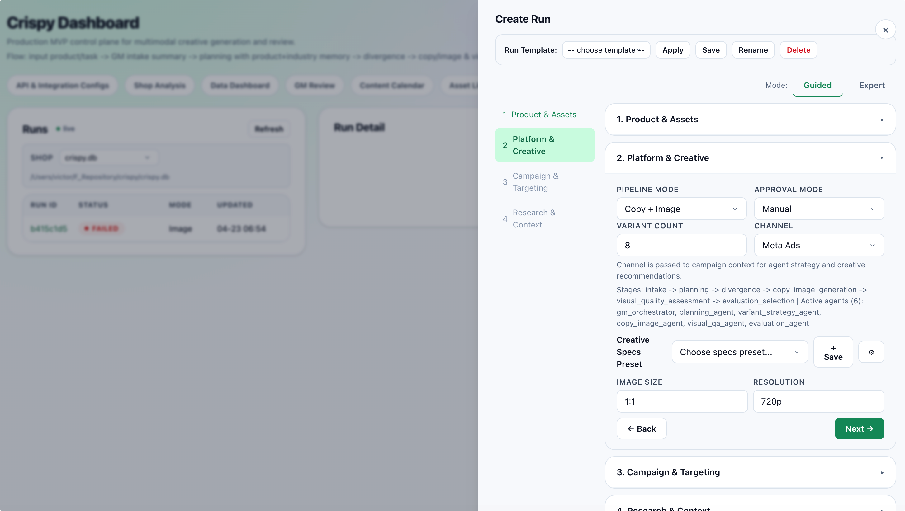

# Crispy



CRISPY is a semi-automated multi-agent pipeline for ad creative generation — copy, image, and video — with a self-improving feedback loop. Built for e-commerce teams who run paid ads across Meta, TikTok, and Shopify.

## Key Features

**Multi-agent pipeline** — Each stage has a specialized AI persona: orchestrator for intake, ideation agent for strategy, generation agent for creative production, scoring agent for evaluation.

**Self-improving memory** — Performance feedback is stored as product-level and industry-level memory. The planning agent automatically references past winners and avoids past failures.

**Human-in-the-loop** — Every creative stage can pause for review. Promote variants, request regeneration, or set winners before publishing.

**Notion calendar sync** — Schedule approved creatives to a Notion database. Channel, date, status, and crispy links are synced bidirectionally.

**Multi-modal input** — Upload product images and videos as reference. The intake stage analyzes them and feeds visual context to all downstream agents.

**Visual QA** — Generated images are automatically checked for common issues (placeholder detection, aspect ratio, resolution). Marketplace mode adds white background and product fill checks.

**Data source switching** — Switch between SQLite databases at runtime. Useful for separating test data from production data.

## Generation Demos

#### 1. Dog Leash
Given a random dog leash as input, the model generates the following high-fidelity result:
<div align="center">
  <video src="https://github.com/user-attachments/assets/77af36e8-a47e-405d-b9a7-b1b7ee39fe87" width="80%" controls></video>
</div>

#### 2. Robe (Multi-View Comparison)
Tested with a random robe sourced from the internet; the corresponding multi-view generation results are as follows:

| Input Image | Video View 1 | Video View 2 | Video View 3 |
| :---: | :---: | :---: | :---: |
|  | <video src="https://github.com/user-attachments/assets/3066a679-ddc8-47d9-9de1-df0d68a4c304" width="100%" controls></video> | <video src="https://github.com/user-attachments/assets/bfe00d55-6f9c-4dd6-8e7b-577474633a2f" width="100%" controls></video> | <video src="https://github.com/user-attachments/assets/4cbe01d5-6e0c-4a77-9b88-a94ab13ba55b" width="100%" controls></video> |

#### 3. White Dress (Long Video)
Below is a 30-second continuous showcase generated from a single white dress image. By ensuring geometric and lighting consistency between the boundary frames of consecutive chunks, the model achieves a long-horizon temporal extension:

| Input Image | Video View |
| :---: | :---: |
||<video src="https://github.com/user-attachments/assets/6795d7e0-a493-464f-a92e-50db57628b8c" width="100%" controls></video>|
## Quick Start

### 1. Install

Requires `uv` and Python 3.11+.

```bash
git clone https://github.com/xolarvill/crispy && cd crispy
uv sync
```

### 2. Add your API keys

```bash
# LLM providers (at least one required)
export CRISPY_API_KEY_OPENAI="sk-..."
export CRISPY_API_KEY_DEEPSEEK="sk-..."
export CRISPY_API_KEY_KIMI="sk-..."

# Notion calendar (optional — for content scheduling)
export CRISPY_API_KEY_NOTION="ntn_..."
export CRISPY_API_KEY_NOTION_DATABASE="your-database-id"

# Shopify data sync (optional — for products, orders, and store memory)
export CRISPY_API_KEY_SHOPIFY_DOMAIN="your-store.myshopify.com"
export CRISPY_API_KEY_SHOPIFY="shpat_..."

# Meta Ads data sync (optional — for campaigns, ads, and performance memory)
export CRISPY_API_KEY_META="EAAB..."
export CRISPY_API_KEY_META_ACCOUNT="1234567890"
```

All keys use the `CRISPY_API_KEY_*` prefix and are auto-discovered.

> 1. To connect to Notion, add an [Internal Connection](https://www.notion.so/profile/integrations/internal), copy its Installation Access Token as Notion api key. The internal connection will be showed as a user-like bot. Give it content access to a database you choose. Extract the code between `notion.so/` and `?v` in the database's website link. This code is the Notion database key.
> 2. To connect to Shopify, create or use a Shopify Admin app for the target store, grant read access for products and orders, then copy the Admin API access token to `CRISPY_API_KEY_SHOPIFY`. Use the `.myshopify.com` store domain for `CRISPY_API_KEY_SHOPIFY_DOMAIN`; the app also accepts the short store name and adds `.myshopify.com` automatically.
> 3. To connect to Meta, create or use a Meta app/system user token that can read the target ad account, campaigns, ads, and insights. Put the token in `CRISPY_API_KEY_META` and the numeric ad account id in `CRISPY_API_KEY_META_ACCOUNT` without the `act_` prefix.

Apply and verify:

```bash
source ~/.zshrc

# Verify — every CRISPY_API_KEY_* var should appear
env | grep CRISPY_API_KEY | sort
```

### 3. Start

```bash
uv run uvicorn app.main:app
```

Open **http://localhost:8000** in your browser.

### 4. Sync Shopify and Meta data

Open **API & Integration Configs** first and confirm the Shopify / Meta rows show configured env vars. Then open **Data Dashboard**, select a workspace and project, and use:

- **Sync Shopify** — pulls products and orders, updates product metadata, and writes product/store GM memory.
- **Sync Meta** — pulls campaigns, ads, and recent ad performance, then imports performance feedback into GM memory.
- **Auto-sync intervals** — set Shopify or Meta to 15, 30, or 60 minutes. Set the interval back to `Off` to disable background sync.

Manual API sync is also available:

```bash
curl -X POST "http://localhost:8000/integrations/shopify/sync?workspace_name=Default&project_name=Default&sync_type=all"
curl -X POST "http://localhost:8000/integrations/meta/sync?workspace_name=Default&project_name=Default&sync_type=all"
```

## Dashboard Tour

| Page | What it does |
|---|---|
| **Dashboard** (home) | Run list, create runs, review & approve/reject stages, view generated creatives |
| **API & Integration Configs** | Assign LLM providers and models to each agent. Save All button at bottom-right |
| **Shop Analysis** | Analyze Shopify stores — products, categories, competitor research |
| **Data Dashboard** | Import performance CSVs, view creative leaderboard, sync Shopify/Meta data |
| **Content Calendar** | Schedule approved creatives to publishing channels. Syncs with Notion |
| **Asset Library** | Browse all generated images and videos across runs |
| **Personas** | View and edit agent prompt personas |

## Core Workflow

1. **Configure agents** — Go to API & Integration Configs, pick providers/models for each agent
2. **Add useful background information** -- Use Shop Analysis to acquire basic information strategy-wise.
3. **Create a run** — Click the + button, fill in product info, upload reference images/videos
4. **Review outputs** — Each stage pauses for human approval (or use semi_auto/full_auto mode)
5. **Schedule winners** — Push approved creatives to Notion Calendar with publish dates
6. **Import feedback** — Upload CSV with ad performance data (impressions, clicks, spend, conversions, revenue), or sync Shopify / Meta data from Data Dashboard.
7. **Next run improves** — The planning agent automatically uses winning patterns from past feedback

## Pipeline Modes

| Mode | Use case |
|---|---|
| `copy_image_only` | Static image ads with copy |
| `video_only` | Short video ads (script → storyboard → video) |
| `full_multimodal` | Both copy+image and video in one run |
| `marketplace_main_image` | White-background product main images for Amazon/Shopify/TikTok Shop |
| `tiktok_shop_video` | TikTok-optimized video ads |

## Database Backup

Your database is automatically backed up to `~/.crispy/backups/` every time the server starts. The last 10 backups are kept.

- **Manual backup**: Click "Backup DB" in the dashboard nav bar
- **Restore**: Click "Restore DB", pick a backup from the list
- **Recovery**: `cp ~/.crispy/backups/crispy-YYYY-MM-DD-HHmmss.db crispy.db`


## Technical Details

See **[agents.md](agents.md)** for:
- Full pipeline stage plans and agent mapping
- Data model reference
- Complete API documentation
- Model routing and configuration architecture
- GM Memory system design
- Worker, concurrency, and retry logic
- Development guide (adding stages, providers, etc.)

## Notes

- Single-user mode with no authentication (MVP)
- Media assets stored locally under `assets/<run_id>/`
- SQLite is the default database; PostgreSQL-compatible schema design
- Agent persona files are editable markdown at `personas/`
- Run `uv run pytest tests/ -x -q` to verify everything works
